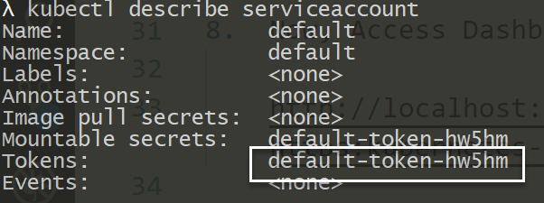
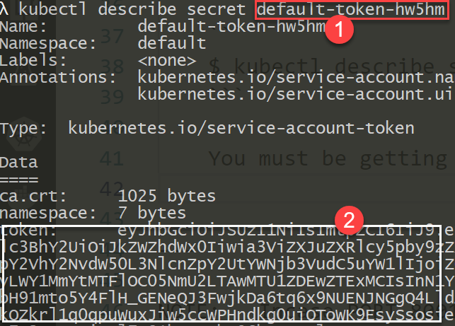
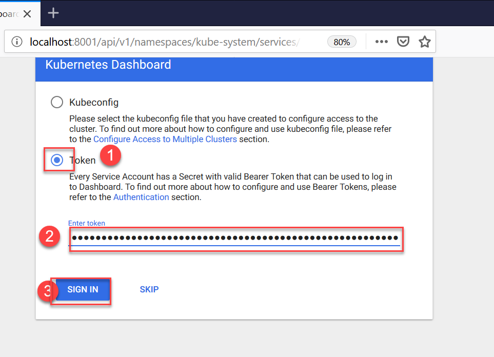

## Setup Kubernetes on Windows 10 (Docker Desktop)
---
1. Right click on "Docker For Desktop" in System Tray
2. Click on "Settings" -> Goto "Kubernetes" --> Turn ON "Enable Kubernetes"
3. Wait for few mins for Kuberenetes to be ready!
4. Open Command prompt and Test cluster using following command:

    ```
    $ kubectl cluster-info
    ```

5.  Next, try few more kubectl commands:

    ```
    $ kubectl get nodes
    $ kubectl get pods --all-namespaces
    ```

6.  Deploy k8s dashboard using command:

    ```
    $ kubectl apply -f admin-user.yaml
    
    $ kubectl apply -f role-binding.yml

    $ kubectl apply -f https://raw.githubusercontent.com/kubernetes/dashboard/v2.0.0-beta1/aio/deploy/recommended.yaml
    ```

7.  Collect the default system token from kubectl
    
    ```
    $ kubectl describe serviceaccounts admin-user -n kube-system
    ```

    You must be getting an output similar to this one:
    

    Now, retrive the actual token string using command:

    ```
    $ kubectl describe secret {TOKEN-NAME} -n kube-system
    ```
    

8.  Now, Turn ON the Web UI (Kubernetes Dashboard) using following command:
    KEEP the Command running, or else dashboard will stop working
    ```
    $ kubectl proxy
    ```

9.  Now, Access Dashboard using following URL:

    http://localhost:8001/api/v1/namespaces/kubernetes-dashboard/services/https:kubernetes-dashboard:/proxy/ 


10. Now, Copy the token from step #7 and paste in Token field in web browser:

    
---

NOTE:   Incase PORT 8001 is Already used, you can try with any other available port

    For Example:
    ```
    $ kubectl proxy -p 8008
    ```
    
Then URL would be:

> http://localhost:8008/api/v1/namespaces/kubernetes-dashboard/services/https:kubernetes-dashboard:/proxy/ 